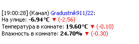
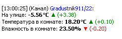
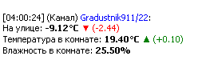
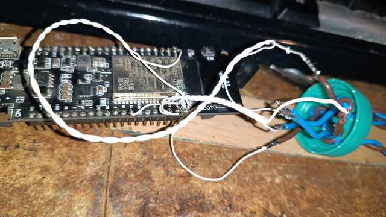
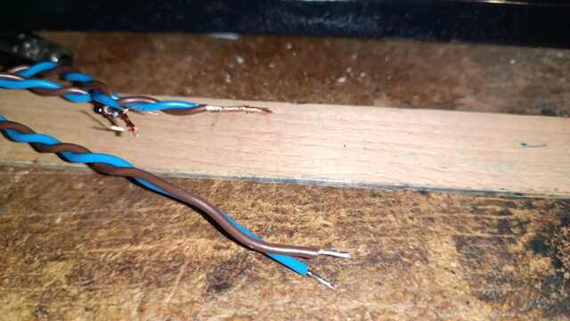
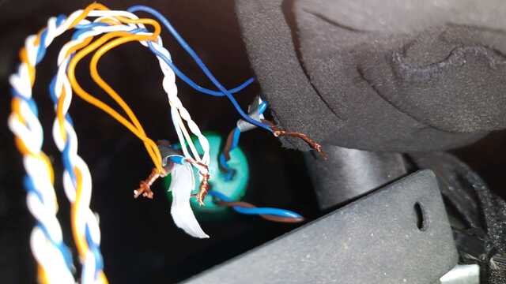
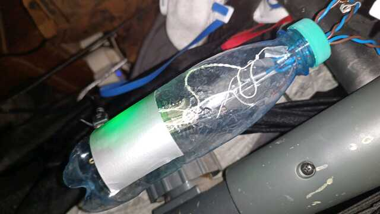
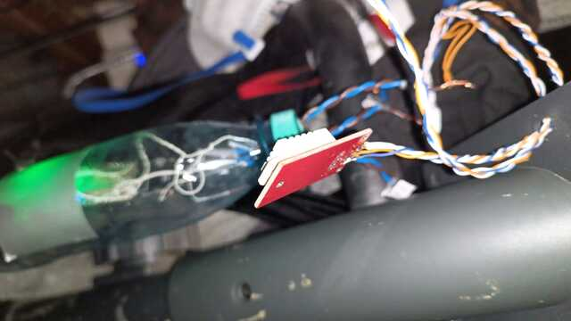

# О проекте

Это мой личный градусник, который измеряет температуру за окном, в комнате и пытается измерять обороты на велотренажере (сейчас эта фича сломана).

Градусник представляет собой Mumble-бота, который входит в конфочку и постит отчеты примерно такого вида:

  

Температура измеряется уличным датчиком на ds16b20 и комнатным на dht22, оба датчика подключены к отладочной плате на ESP32 rev1.0

# Как собирать

Вам понадобится ESP-IDF, возможно немного линупса.

1. Для работы с вайфаем надо заполнить файлик `root/wifi.txt`, создать файловую систему с ним и прошить ее
2. Для мамбла нужно будет создать самоподписанный сертификат и засунуть его в `keys.inc` (по примеру `keys.inc.template`)
3. Если собирать штатными средствами IDF, то надо будет включить опцию `CONFIG_BOOTLOADER_APP_ROLLBACK_ENABLE` и прочие OTA для работы обновлений

# Внешний вид готового устройства

## Готовое устройство

У меня был модуль от TTGO, который интегрирует в себе ESP32 WROOM-B и литиевую батарейку 18650. Впрочем, сейчас это питается от телефонного зарядника по USB.

## ШВВП в качестве терминальных соединений

Очень важно сделать так, чтобы корпус обеспечивал плату защитой на тот случай, если я задену провода и попробую выдрать их. Чтобы не выдрать дорожки из платы,
я использовал провода ШВВП, которые дополнительно завязал узлом в пробочке. Сам провод ШВВП очень удобно использовать для последущих скруток.

## ШВВП в скрутке с витой парой

Подключение к датчикам. Датчики уже были на витой паре и торчали из окна, демонтировать не хотелось, потому все оставил на скрутках. Пока работает.

## Стильный и недорогой корпус

Корпус выполнен из пет-бутылки на 0.25 литра (газированная вода "черноголовка") за 30 рублей. Бутылка имеет нескучный рисунок. Скотч снизу наклеен, чтобы зеленый светодиод не выжигал мне глаза.

## Комнатный датчик

Комнатный датчик болтается в комнате, тем самым развязан с улицей и не подвержен влиянию ни сквозняков из окна, ни искажениям температуры за счет контакта с чем-либо еще, имеющим термомассу.

# Наши достижения

 

# Лицензия

Вообще статус лицензии не очень понятен, так как код основан на примере hello_world от самого Espressif, в проект входят сторонние библиотеки, которые к тому же пришлось править.

Лично мой код публикуется под GPLv3, но подробности пусть выясняет ваш местный суд.